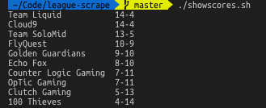

# League Scrape

These scripts work together to get and display LCS standings on the command line by webscraping 'The Score Esports.'

The webscraper was done using selenium open the browser and click on dynamic elements while scrapy was used to actually scrape the teams and scores. Then, the output was saved as json file and sent to another python script which formatted it nicely. All this was packaged together with a bash script.

To use, simply download all files and run showscores.sh.